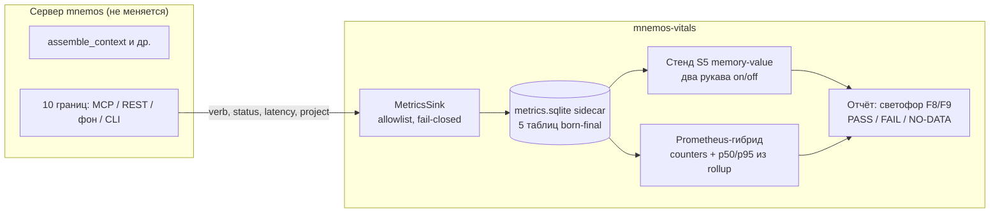

# mnemos-vitals

**Методология и инструментализация честного измерения работы сервера памяти Mnemos.**
Доказывать — или честно опровергать — каждое обещание: динамический контекст, правильная
память на запрос, экономию токенов, здоровье каждой подсистемы.

[Навигация](#навигация) · [Что это](#что-это) · [Почему отдельный проект](#почему-отдельный-проект) · [Архитектура](#архитектура) · [Документация](#документация) · [Статус](#статус)

## Что это

Владелец Mnemos сформулировал проблему (2026-09-09): «на словах и доках всё красиво,
а по факту нет ощущения, что контекст РЕАЛЬНО динамически формируется. Сколько токенов
реально экономим? Подставляется ли нужная инструкция или кусок памяти по запросу?»
Стенды сервера (S1–S4) меряют качество выдачи и латентности — ни один не отвечает,
**что память даёт петле** и **работает ли каждая функция**.

mnemos-vitals закрывает этот разрыв двумя контурами:

| Контур | Вопрос | Охват |
|---|---|---|
| **Health** | «Работает ли функция?» | Каждая функция сервера: вызывается / успешно / латентность / ошибки. Правило: ни одна функция не едет в релиз без своего контура. |
| **Value** | «Что функция даёт?» | Только функции с продуктовым обещанием. Причинная ценность («сколько токенов сэкономлено») доказывается только двухрукавным replay-стендом S5 — «saved X» из пассивных данных запрещён. |

Оба решения приняты Архитектурным комитетом mnemos (2026-09-09, mnemos `7ec9dda3`
ядро + `061398fe` аддендум «весь функционал»); ADR-0026 mnemos — формальная запись.
Этот репозиторий — реализация.

## Почему отдельный проект

- **Граница доверия**: сборщик метрик — гость в сервере. Изоляция кода исключает
  случайное сращивание телеметрии с конвейером `assemble_context` и основным стором.
- **Контракт внедрения**: mnemos-vitals встраивается в mnemos минимальными точками
  (10 определённых границ), сервер не зависит от него.
- **Скорость**: свой CI, свои релизы, свой ревью-цикл — метрики не ждут релизного
  окна сервера.
- **Переиспользуемость**: методология применима к любому серверу памяти с той же
  формой контракта (харнес → память → модель).

## Навигация

| Раздел | Что внутри | Кому |
|---|---|---|
| [docs/methodology.md](docs/methodology.md) | Полная методология: зоны, контуры, метрики, статусы, фазы | Всем — точка входа |
| [docs/architecture.md](docs/architecture.md) | Компоненты, схема данных, точки сбора, Prometheus-гибрид | Реализатору |
| [docs/decisions/](docs/decisions/) | Журнал решений (перенос канона АрхКома) | Будущим контрибьюторам |
| [docs/claims.md](docs/claims.md) | Claims-ledger: обещание → метрика → статус | Владельцу — «что уже доказано» |
| [docs/experiments/](docs/experiments/) | Препрегистрации (анти-HARKing, до первого прогона) | Аналитику |
| [src/mnemos_vitals/](src/mnemos_vitals/) | Код: sink, леджер, экспозер, стенд S5 | Реализатору |
| [CHANGELOG.md](CHANGELOG.md) | История изменений | Всем |

## Архитектура

Ключевые свойства: allowlist-схема **без колонок для сырого текста** (приватность —
структурой, не фильтром), keyed-HMAC-отпечатки, born no-federate, TTL 30/90 дней
fail-loud, таксономия статусов — инвариант / коридор / вердикт.

## Документация

| Документ | Роль |
|---|---|
| [docs/methodology.md](docs/methodology.md) | Канон методики: что и как меряем, пороги, честность |
| [docs/architecture.md](docs/architecture.md) | Техническая спецификация реализации |
| [docs/decisions/0001-two-circuits.md](docs/decisions/0001-two-circuits.md) | Почему два контура, а не «value для всего» |
| [docs/decisions/0002-sidecar-ledger.md](docs/decisions/0002-sidecar-ledger.md) | Почему sidecar-стор, а не таблицы в основном сторе |
| [docs/decisions/0003-family-boundaries.md](docs/decisions/0003-family-boundaries.md) | Правило границ метрик-семейств (тема, не ярус) |

## Статус

**Фундамент заложен (2026-09-09); фаза A в работе.** Библиотечное ядро пассивного
сбора готово (born-final схема + C1-канарейка + `MetricsStore`, 33 теста зелёных);
интеграция в mnemos — отдельным PR в репо сервера. Полный статус —
[docs/status.md](docs/status.md). Обещания и их измеренный статус —
[docs/claims.md](docs/claims.md).

## Критичные действия

| Действие | Команда | Безопасность |
|---|---|---|
| Сброс metrics.sqlite (локальный стор метрик) | `rm <data_dir>/metrics.sqlite` | Разрешено: метрики — не аудит-записи; стор пересоздаётся born-final |
| Полная переустановка витринов | `rm -rf <data_dir>/vitals` | Разрешено: не трогает основной стор mnemos |
| Отключение сбора | `vitals.enabled: false` в config | Разрешено: отказ записи non-fatal по дизайну |

Любое действие, затрагивающее основной стор mnemos, выполняется только средствами
mnemos — mnemos-vitals не имеет API записи в него.

---

Лицензирование — по решению владельца; проект наследует канон экосистемы Mnemos.